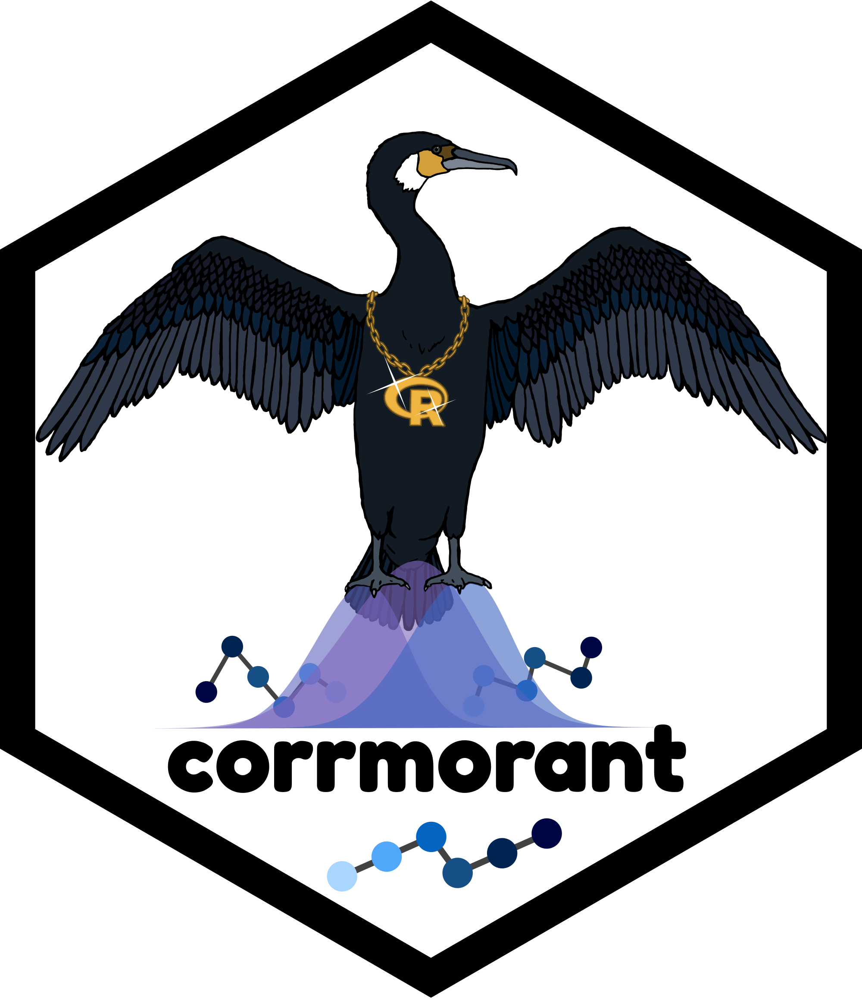

Hex logo for the corrmorant package
================

## Description

The present projects contains the hex logo for the R package
[corrmorant](https://github.com/r-link/corrmorant).

The logo is based on an ink pen drawing that was edited with
[GIMP](http://www.gimp.org/) v. 2.10.18 and
[Inkscape](https://www.inkscape.org/) v. 0.98. The font used in the logo
is [Fredoka One](https://fonts.google.com/specimen/Fredoka+One) by
Milena Brandao (OFL 1.1).

An .SVG version of the logo as well as different sized .png versions are
available in the subfolder
[logos](https://github.com/r-link/corrmorant_logo/tree/master/logos).
